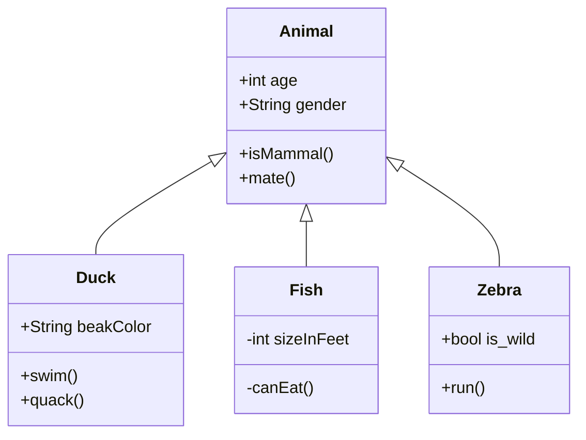

Every application, whether it is a banking system, an e-commerce platform, or a social 
media service, needs a reliable way to record what is happening internally while it is 
running. These records, called **logs**, help developers and operations teams understand 
application behavior, diagnose failures, trace important business events, and monitor the 
health of the system without directly inspecting the running code.

Scattering `System.out.println()` statements throughout the code quickly becomes difficult 
to manage. Different teams may produce logs in different formats, important information 
may be missing, and changing the output destination later would require modifying 
application code in multiple places.

The application developer should not need to worry about how a message is formatted, where 
it is stored, or whether multiple destinations are configured. By introducing a **logging 
abstraction**, the application can have a consistent logging format, configurable log 
levels, a reusable API, and the flexibility to route the same log message to multiple 
destinations without changing the business logic.


--- 

### Functional Requirements

Design a `logger` library that:

1. Each log record should display **timestamp**, **level**, **message**, and **emitting 
thread name**.

2. Support different log levels (`INFO`, `DEBUG`, `WARN`, or `ERROR`) and allow the 
application to configure the minimum severity level that should be recorded.

3. Support multiple output destinations simultaneously. For example, an `ERROR` log could 
be written to both a file and a database.

4. The logging destinations should be extensible so that a new destination can be added 
without modifying the core logging logic.

5. Logging should have minimal impact on the application's performance. Where 
appropriate, log messages should be processed asynchronously rather than blocking the 
application thread.

6. A failure in one logging destination should not bring down the application or prevent 
the same log message from being delivered to other configured destinations.

---

### Sequence Flow

A logging service acts as an abstraction between the application and the actual 
destination where logs are stored/printed. Whenever an application wants to log an event, 
it calls the logger with a message 

---

`Logger` holds many `Destination` instances, fixed at construction. Each `Destination` 
holds exactly one `Formatter`. 

`Logger` creates a `LogRecord` per `log()` call and hands the same record to every 
destination. Each destination independently checks the level, formats the record 
(or doesn't, if filtered out), and writes.

#### Destination Writes to output

1. Drop the record if its level is below the destination's threshold.
2. Format the record using the formatter.
3. Acquire the per-destination lock.
4. Hand the formatted string to the sink.
5. Release the lock (always, even if the sink throws).

<br/>

---

### Design Rationale



##### **<span className="text-emerald-700">Q. Different processes in an application print logs simultaneously. How to handle this?</span>**

Multiple threads can call the `logger.log(message)` method simultaneously. The logger 

##### **<span className="text-emerald-700">Q. Does each destination decide its own filter level, or is there one global level on the logger?</span>**

Per destination. Each destination has its own minimum level. The console might want 
everything from `DEBUG` up, and the file destination might only care about `WARN` and 
above. Records below a destination's threshold should be dropped before being written.

##### **<span className="text-emerald-700">Q. What goes there when sink.write() throws?</span>**

Naive Approach:

Don't catch anything. If sink.write() throws, the exception bubbles through Destination.
write() and into Logger.log()'s iteration loop. The loop terminates and the exception 
keeps going up into the application code that called logger.error(...). However, 
The cost is severe in a multi-destination setup. Imagine you've configured a console sink, a file sink, and a future remote sink. The disk fills up. FileSink.write throws IOException. Logger.log() is mid-iteration when the exception fires, so the console got the record, but the remote never sees it.
Worse, the exception now propagates into the application code that called 
logger.error("payment failed"). A logger is infrastructure that should never crash the 
caller. If a payment-processing function throws because logging failed, you've just 
turned a logging problem into a payment problem. Anyone reading the resulting stack 
trace will spend an hour chasing a payment bug that doesn't exist.

Better Approach:

Catch any exception from sink.write() and discard it. The destination's failure is its 
own problem. Other destinations and the calling code never see it.

```
write(record):
    if record.level < minLevel: return
    formatted = formatter.format(record)
    lock.acquire()
    try:
        sink.write(formatted)
    catch e:
        // swallow; don't crash the logger
    finally:
        lock.release()
```

The downside is silent failure. If your file destination is broken, you get no signal at 
all. The application keeps running. The console keeps showing logs. But the file you 
depend on for forensic analysis has been empty for three days, and you won't notice until 
something else goes wrong and you go looking. For a production logger this is a real 
operational problem - the logger is failing exactly when you most need it to be working.

Suitable Approach:

Catch the exception, but before swallowing, write a one-line diagnostic to a known-good 
fallback stream. The original record is still lost, but the failure itself is visible. The 
fallback is typically stderr (or a separate "internal logger" if your library has one).

```
write(record):
    if record.level < minLevel: return
    formatted = formatter.format(record)
    lock.acquire()
    try:
        sink.write(formatted)
    catch e:
        stderr.write("logger: sink write failed: " + e.message)
    finally:
        lock.release()
```

This is what production loggers actually do. Log4j has a StatusLogger that writes to 
stderr when an appender fails. Python's logging defaults to writing to sys.stderr when 
handlers raise. It balances "don't crash the caller" with "don't fail silently."

---

### Low-Level Design

#### Logger Interface

`Logger` is the only class the application ever needs to know about. Everything else lives 
behind it.

Something has to be the public face of the library. When the application calls `logger.info("...")`, 
something has to capture the timestamp and thread name, build a `LogRecord`, and dispatch 
it to every configured destination. That's `Logger`.

It owns the list of destinations and exposes `log()` plus the convenience helpers 
(`debug`, `info`, `warn`, `error`, `fatal`) that callers actually use. It's the entry 
point and the only class the application ever touches.

```
interface Logger { 
	/**
	* When a process starts, it calls 'start' with processId and startTime.
	*/
	void start(String processId, long startTime);
	
	/**
	* When the same process ends, it calls 'end' with processId and endTime.
	*/
	void end(String processId, long endTime);

	/**
	* Prints the logs of this system sorted by the start time of processes in the below format
	* {processId} started at {startTime} and ended at {endTime}
	*/
	void print();
}

class Logger:
    - destinations: List<Destination>   // immutable after construction
```

Why make `List<Destination>` immutable after construction?

The constructor takes the destinations once and stores an immutable copy. There's 
deliberately no addDestination, no setters, no builder. Config is fixed at startup, so the 
API doesn't expose a way to mutate it.

Iteration is safe under concurrent calls with no locking. A mutable list with 
addDestination() would force locking around iteration without buying anything the 
requirements asked for.

`log(level, message)` builds a `LogRecord` and dispatches.

`info(msg)` just calls `log(INFO, msg)`. They're worth including because they match the 
API callers actually use. Calling `log(LogLevel.INFO, "...")` everywhere works, but it's 
noisier than `info("...")`, and a logger is infrastructure that tens of thousands of call 
sites will touch so the ergonomics matter.

```java
log(level, message):
    // Build a LogRecord from those plus the caller's level and message.
    record = new LogRecord(
        // Capture the current timestamp
        timestamp  = now(),
        level      = level,
        message    = message,
        // Capture the current thread's name
        threadName = currentThread().name
    )
    // Iterate over destinations and call write(record) on each.
    for destination in destinations:
        destination.write(record)
```

`now()` and `currentThread().name` get called once at the top of `log()` rather than 
once per destination, so every destination sees the same record with the same timestamp 
and the same thread name. 

<Note>
A null or empty message gets accepted as-is rather than guarded against. The logger isn't 
in the business of validating what callers hand it, and bolting a defensive null check 
onto a code path that fires from tens of thousands of call sites adds noise everywhere for 
almost no real protection.
</Note>

Synchronize the entire `log()` method on Logger. Every call from every thread is 
serialized through one lock. A slow file write (disk full, contended I/O, unreachable 
network destination) now blocks every other call to log, including console writes that 
should have been instant. The right default for per-resource concurrency is one lock per 
resource. Here we're using one lock to protect five unrelated resources. This also blocks 
formatting, which doesn't need locking at all (records are immutable, formatters are 
stateless). Coarse locking is fine when the workload is sparse and the resources are 
uniform. Ours is neither.

<Note>
The shared state lives on each destination's sink, not on the logger itself, so by 
default the lock belongs next to the sink. When the shared state lives somewhere else, 
that's a strong signal the lock belongs there too.
</Note>

#### LogRecord Class

`LogRecord` is the value object flowing through the system. `LogRecord` is the value 
object flowing through the system. Every `log()` call creates one, every destination 
consumes one, and the fields never change after construction. It's a dumb container by 
design: no behavior, just data.

Every call to `log()` generates a unit of data made up of a **timestamp**, a **level**, a 
**message**, and a **thread name**. These fields always travel together. Every destination 
receives them, every formatter serializes them, and they never change after creation. 

That's the textbook case for a value object. Modeling them as one class instead of 
passing four parameters everywhere gives formatters a stable shape and lets you add 
fields later (a logger name, a request ID, a context map) without changing every method 
signature in the system.

```
class LogRecord:
    - timestamp: Instant
    - level: LogLevel
    - message: String
    - threadName: String

    + LogRecord(timestamp, level, message, threadName)
    + getters for all fields
```

A record represents what happened at one moment in one thread. None of those facts change 
after the call site. Making the fields immutable closes off a whole class of bugs. Any 
destination, any formatter, any future extension can read a record without worrying 
about racing another thread or accidentally mutating shared state.

<Note>
Here we don't even have collections to defensively copy, just primitives, an enum, and a 
timestamp.
</Note>


#### LogLevel Enum

```
enum LogLevel:
    DEBUG
    INFO
    WARN
    ERROR
    FATAL
    // ordered: DEBUG < INFO < WARN < ERROR < FATAL
```

#### Formatter Interface

An interface for serializing a LogRecord to a string. Two implementations exist 
(plain text and JSON), and new formats become new implementations without touching 
anything else.

This is the Strategy pattern — pulling format behind its own interface lets a `Destination` 
compose whichever formatter it wants.

```
interface Formatter:
    + format(record: LogRecord) -> String

class PlainTextFormatter implements Formatter
class JsonFormatter implements Formatter
```

Formatters are pure functions. They take a record, return a string, end. That makes them 
safe to share across threads and across destinations. Two destinations can hold a 
reference to the same JsonFormatter instance without any synchronization, because there's 
nothing to synchronize.

#### Destination Class

It owns a minimum level threshold for filtering, a formatter for serializing, and the 
actual write mechanism for output. It also owns the per-destination lock for concurrent 
safety.

##### **Naive Implementation**

One concrete Destination class with a type field. The `write()` method branches on the 
type to decide what to do.

```
class Destination:
    - type: DestinationType            // CONSOLE | FILE
    - formatter: Formatter
    - minLevel: LogLevel
    - filePath: String                  // only used when type == FILE

    + write(record):
        if record.level < minLevel: return
        formatted = formatter.format(record)
        if type == CONSOLE:
            stdout.write(formatted)
        else if type == FILE:
            fileWriter(filePath).write(formatted)
```

This approach seems to break the moment you add a third destination. Every new target adds 
a branch in `write()`, and most of them add fields that only apply to that one target 
(`filePath` for files, `socketAddress` for remote, `kafkaTopic` for Kafka). You end up 
with a class where most fields are null for any given instance, and a `write()` method 
that's a switch statement masquerading as **polymorphism**. 

The design problem is "behavior varies by type," and a switch statement is the answer 
that scales worst as types are added. It also violates Open/Closed, since every new 
destination type forces you to crack open `Destination` and edit existing logic.

##### **Better Implementation**

This is the textbook anti-pattern that interfaces and inheritance both exist to fix. 

**Inheritance with template method**: Destination becomes an abstract base class that owns 
the filter-and-format logic. Subclasses implement the actual write step.

```
abstract class Destination:
    - formatter: Formatter
    - minLevel: LogLevel
    - lock: Lock

    + write(record):
        if record.level < minLevel: return
        formatted = formatter.format(record)
        lock.acquire()
        try:
            doWrite(formatted)
        finally:
            lock.release()

    # doWrite(formatted: String)        // abstract — subclass fills this in

class ConsoleDestination extends Destination:
    + doWrite(formatted): stdout.write(formatted)

class FileDestination extends Destination:
    - filePath: String
    + doWrite(formatted): fileWriter(filePath).write(formatted)
```

This is the template method pattern and it does the most important job. It puts the 
filter-and-format invariant in exactly one place. A new subclass author can't forget the 
level check or skip the formatter, because they don't write `write()`. They only write 
`doWrite()`. That's a real win over the type-branching version. The base class also gives 
you a natural home for the lock.

The problem with this approach is that inheritance is a heavy commitment for what's 
mostly a single axis of variation. `ConsoleDestination` and `FileDestination` don't 
actually share any data with their parent. They just inherit a method. That's a thin 
reason to use inheritance. The bigger pain shows up when you want to wrap a destination 
in something, say buffering or retry or a fan-out to two underlying targets. With an 
inheritance hierarchy, "wrap" means "subclass and override," which composes badly. You 
can't easily build a `BufferedFileDestination` without re-implementing the file-handling 
logic, and stacking two wrappers means three levels of inheritance for what should be 
one wrapping operation.

##### **Suitable Implementation**

**Composition with Sink Interface**: We're going with the composition variant. It keeps 
the filter-and-format invariant in one place (the same win as the inheritance approach), 
avoids a hierarchy that pays no real dividend, and gives the requirement-stated remote 
destination a clean place to land as a new `Sink`.

```
class Destination:
    - formatter: Formatter
    - minLevel: LogLevel
    - sink: Sink

    + Destination(formatter, minLevel, sink)
    + write(record: LogRecord)

interface Sink:
    + write(formatted: String)

class ConsoleSink implements Sink
class FileSink implements Sink:
    - filePath: String
```

`Sink` a small interface, one method and one responsibility, and it's where future 
extensions will plug in.

`Destination.write()` filters, then formats, then writes to the sink under a lock.
One lock per Destination instance. The critical section covers sink.write(). Filter 
check and formatting happen outside the lock since the record is immutable and the 
formatter is a pure function.

```
class Destination:
    + write(record):
        if record.level < minLevel: return
        formatted = formatter.format(record)
        lock.acquire()
        try:
            sink.write(formatted)
        finally:
            lock.release()
```

This is the per-resource locking pattern. Each destination protects its own resource with 
its own lock, so a slow file write doesn't block console output, and a hung remote 
destination doesn't block file or console. The critical section is the smallest correct 
one, just the parts of write() that touch shared state (the sink). The parts that don't 
(filter, format) stay outside.


<Note>
The design demonstrates **Separation of Concerns** all the way through, with orchestration 
in `Logger`, data in `LogRecord`, classification in `LogLevel`, serialization in 
`Formatter`, output in `Sink`, and the per-destination invariants (filter, compose) in 
`Destination`. Every class owns exactly one reason to change. 
</Note>

---

### Follow-up Questions

##### **<span className="text-emerald-700">Q. How would you make log() non-blocking?</span>**

The current design holds a per-destination lock around sink.write(). That's correct, but it 
means a slow file write or a flaky network destination blocks the calling thread for as 
long as the I/O takes. For a logger that fires from tens of thousands of call sites, that 
adds up to real latency in the application.

"I'd put a bounded blocking queue in front of each destination's sink. log() enqueues the 
record and returns immediately, and a dedicated worker thread per destination drains the 
queue and does the actual write. Concurrent producers, single consumer per resource, which 
means the consumer side doesn't even need a lock anymore."

```
class Destination:
    - formatter, minLevel, sink
    - queue: BlockingQueue<LogRecord>    // bounded
    - worker: Thread

    + Destination(formatter, minLevel, sink, capacity):
        this.queue  = new BlockingQueue(capacity)
        this.worker = startThread(drain)

    + write(record):
        if record.level < minLevel: return
        queue.put(record)                // blocks if full (or drop / throw)

    - drain():                            // runs on the worker thread
        while running:
            record    = queue.take()
            formatted = formatter.format(record)
            sink.write(formatted)         // single consumer, no lock needed
```

- **Worker lifecycle**: Each destination now owns a thread that runs for the life of the application. Shutdown is the tricky part — you have to signal the worker to stop, drain whatever's already in the queue, and wait for it to finish before the process exits. Skip that and you lose every record that was buffered when the JVM (or whatever) died.
- **Overflow policy**: A bounded queue forces a decision about what happens when it fills up. You've got four reasonable choices and each one is wrong for some workload. block the producer (which defeats the whole point of going async), drop the new record (which silently loses data right when something's going wrong), drop the oldest record (same problem, different end of the queue), or throw an exception (which turns logging back into something callers have to catch). Most production loggers default to drop-newest with a stderr diagnostic, but the right answer depends on whether you care more about not losing records or not blocking callers.
- **Debuggability**: The actual write now happens on a different thread than the call site. A stack trace at the moment of an I/O failure no longer points back to the code that emitted the record, which makes "why did this log line fail to write?" meaningfully harder to answer. You can mitigate by logging the record's call-site info into the diagnostic, but the gap is real.

##### **<span className="text-emerald-700">Q. How would you support hierarchical named loggers?</span>**

Production loggers don't construct one global Logger and pass it around. They expose 
`LoggerFactory.getLogger("com.app.service.payments")`, and the returned logger inherits 
configuration from its parent in the dotted-name tree. The team that owns com.app.service 
can set its threshold once and have everything underneath pick it up unless overridden.

The factory is a deliberate global. The whole point of the registry is that two callers 
anywhere in the codebase asking for getLogger("com.app.service") get back the same 
instance. That's the rare case where shared application state is the requirement, not an 
accident.

---

